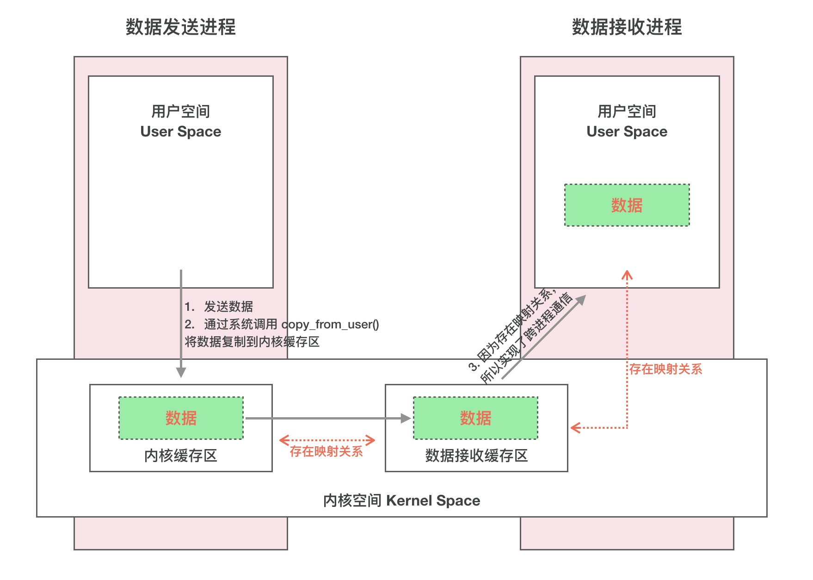
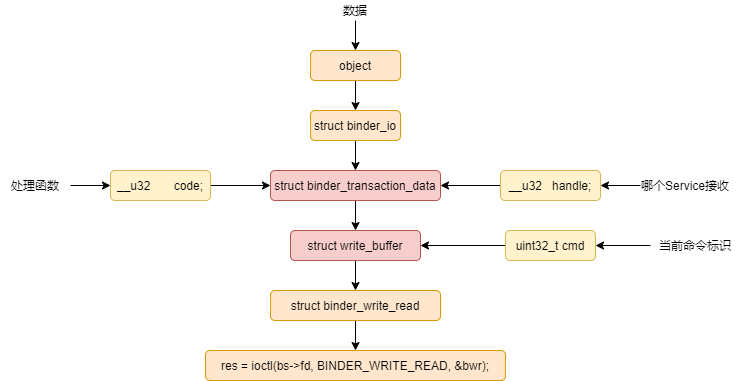
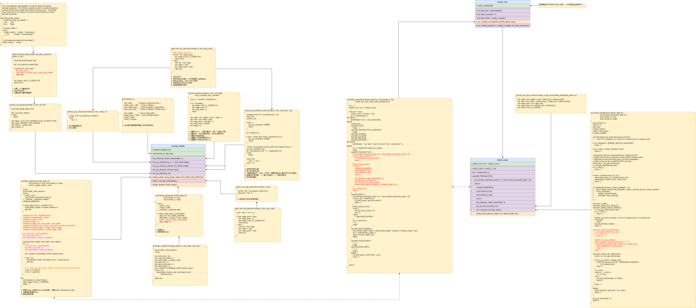
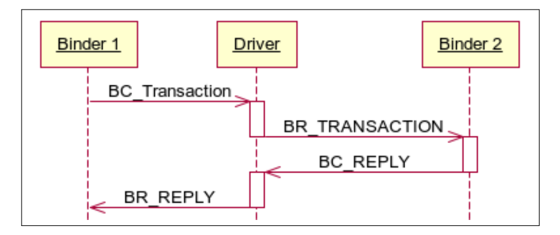
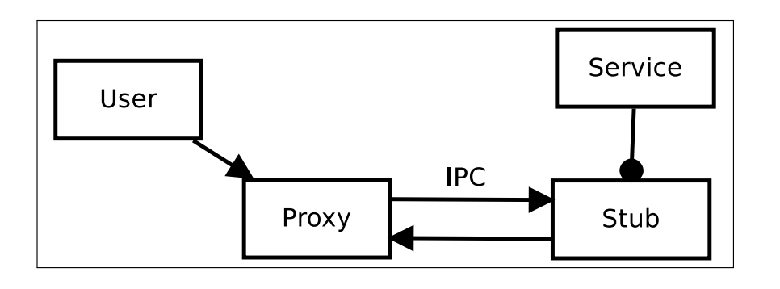

# Android Binder

移植Android Binder到树莓派

## 参考文档

* [Binder系列1—Binder Driver初探](http://gityuan.com/2015/11/01/binder-driver/)
* [Android Binder机制(三) ServiceManager守护进程](https://wangkuiwu.github.io/2014/09/03/Binder-ServiceManager-Daemon/)
* [binder-for-linux](https://github.com/hungys/binder-for-linux)
* [Android Binder 修炼之道（二）Client Server 实例](https://blog.csdn.net/lizuobin2/article/details/76321770)
* [Binder子系统之调试分析(二)](http://gityuan.com/2016/08/28/binder-debug-2/)
* [0029_Linux_Kernel_Compile.md](0029_Linux_Kernel_Compile.md)

## Binder模型

* 参考： [写给 Android 应用工程师的 Binder 原理剖析](https://zhuanlan.zhihu.com/p/35519585)
* 一次完整的 Binder IPC 通信过程通常是这样：  
  
  * 首先 Binder 驱动在内核空间创建一个数据接收缓存区；
  * 接着在内核空间开辟一块内核缓存区，建立内核缓存区和内核中数据接收缓存区之间的映射关系，以及内核中数据接收缓存区和接收进程用户空间地址的映射关系；
  * 发送方进程通过系统调用 copyfromuser() 将数据 copy 到内核中的内核缓存区，由于内核缓存区和接收进程的用户空间存在内存映射，因此也就相当于把数据发送到了接收进程的用户空间，这样便完成了一次进程间的通信。  
* 应用示例模型：  
  
  * Client、Server、ServiceManager、Binder 驱动这几个组件在通信过程中扮演的角色就如同互联网中服务器（Server）、客户端（Client）、DNS域名服务器（ServiceManager）以及路由器（Binder 驱动）之前的关系。

## Binder详细说明

Android Binder 设计与实现一文中对 Client、Server、ServiceManager、Binder 驱动有很详细的描述，以下是部分摘录

### Binder 驱动

Binder 驱动就如同路由器一样，是整个通信的核心；驱动负责进程之间 Binder 通信的建立，Binder 在进程之间的传递，Binder 引用计数管理，数据包在进程之间的传递和交互等一系列底层支持。

### ServiceManager 与实名 Binder

ServiceManager 和 DNS 类似，作用是将字符形式的 Binder 名字转化成 Client 中对该 Binder 的引用，使得 Client 能够通过 Binder 的名字获得对 Binder 实体的引用。注册了名字的 Binder 叫实名 Binder，就像网站一样除了除了有 IP 地址意外还有自己的网址。Server 创建了 Binder，并为它起一个字符形式，可读易记得名字，将这个 Binder 实体连同名字一起以数据包的形式通过 Binder 驱动发送给 ServiceManager ，通知 ServiceManager 注册一个名为“张三”的 Binder，它位于某个 Server 中。驱动为这个穿越进程边界的 Binder 创建位于内核中的实体节点以及 ServiceManager 对实体的引用，将名字以及新建的引用打包传给 ServiceManager。ServiceManger 收到数据后从中取出名字和引用填入查找表。

细心的读者可能会发现，ServierManager 是一个进程，Server 是另一个进程，Server 向 ServiceManager 中注册 Binder 必然涉及到进程间通信。当前实现进程间通信又要用到进程间通信，这就好像蛋可以孵出鸡的前提却是要先找只鸡下蛋！Binder 的实现比较巧妙，就是预先创造一只鸡来下蛋。ServiceManager 和其他进程同样采用 Bidner 通信，ServiceManager 是 Server 端，有自己的 Binder 实体，其他进程都是 Client，需要通过这个 Binder 的引用来实现 Binder 的注册，查询和获取。ServiceManager 提供的 Binder 比较特殊，它没有名字也不需要注册。当一个进程使用 BINDERSETCONTEXT_MGR 命令将自己注册成 ServiceManager 时 Binder 驱动会自动为它创建 Binder 实体（这就是那只预先造好的那只鸡）。其次这个 Binder 实体的引用在所有 Client 中都固定为 0 而无需通过其它手段获得。也就是说，一个 Server 想要向 ServiceManager 注册自己的 Binder 就必须通过这个 0 号引用和 ServiceManager 的 Binder 通信。类比互联网，0 号引用就好比是域名服务器的地址，你必须预先动态或者手工配置好。要注意的是，这里说的 Client 是相对于 ServiceManager 而言的，一个进程或者应用程序可能是提供服务的 Server，但对于 ServiceManager 来说它仍然是个 Client。

### Client 获得实名 Binder 的引用

Server 向 ServiceManager 中注册了 Binder 以后， Client 就能通过名字获得 Binder 的引用了。Client 也利用保留的 0 号引用向 ServiceManager 请求访问某个 Binder: 我申请访问名字叫张三的 Binder 引用。ServiceManager 收到这个请求后从请求数据包中取出 Binder 名称，在查找表里找到对应的条目，取出对应的 Binder 引用作为回复发送给发起请求的 Client。从面向对象的角度看，Server 中的 Binder 实体现在有两个引用：一个位于 ServiceManager 中，一个位于发起请求的 Client 中。如果接下来有更多的 Client 请求该 Binder，系统中就会有更多的引用指向该 Binder ，就像 Java 中一个对象有多个引用一样。

## Binder个人理解

* Binder通信是基于共享内存，Binder驱动规划好了基本的通信数据格式（Message Header），占用一部分通信，其他部分空间交由函数调用参数（对象）用于序列化（Parcel）；
* Binder通信Client调用的参数对象传递是需要序列化（Parcel）进行编码，然后拷贝进入共享内存对应的空间，然后在Service服务端进行解码，进而生成新的对象；
* 实现Stub的是服务端，在系统只会有一个；Stub.asInterface()是服务端的客户端，可以有多个。类比到C/S架构的客户端、服务端；
* 我们常用的传感器、键盘、鼠标的Listener相当于自己是Stub（服务端），然后把Stub.asInterface（客户端）传递给了内核对应的系统服务，所以在Android传感器服务中可以看到注册了哪些监听，这些监听都是Binder Client，用于回调应程序里Listener（服务端）中的函数：
  * adb shell dumpsys sensorservice
* Binder通信中0号通道用于ServiceManager，即用于Binder通信管理，注册、查询Binder都是通过0号通道，0号通道可以理解为文件描述符(fd)编号为0；
* 应用层与内核中的driver之间的IO操作使用统一的接口函数`ioctl(fd,CMD,&bwr)`，通过switch(CMD)进行相应的IO操作，所传输的数据则存放在`binder_write_read`结构体中：
  ```C
  struct binder_write_read {
      binder_size_t write_size;
      binder_size_t write_consumed;
      binder_uintptr_t write_buffer;
      binder_size_t read_size;
      binder_size_t read_consumed;
      binder_uintptr_t read_buffer;
  };
  ```
  * 存放在`binder_write_read`的`write_buffer`/`read_buffer`中的数据也有格式，即：消息ID(函数ID) + `binder_transaction_data`，每一个消息ID表示一个函数:
    ```C
    struct binder_transaction_data {
        union {
            __u32 handle;
            binder_uintptr_t ptr;
        } target;
        binder_uintptr_t cookie;
        __u32 code;
        __u32 flags;
        pid_t sender_pid;
        uid_t sender_euid;
        binder_size_t data_size;
        binder_size_t offsets_size;
        union {
            struct {
                binder_uintptr_t buffer;
                binder_uintptr_t offsets;
            } ptr;
            __u8 buf[8];
        } data;
    };
    ```
  * `binder_transact_data`中包括了从应用层传输过来的Parcel类的数据data，以及Binder对象数据。驱动层只负责操作转换Binder相关的数据，对应用层Parcel中的普通数据并不关心。当然如果Parcel中打包了Binder对象，驱动也会进行处理。Binder对象在跨进程传输时，驱动会对其进行转换。
* 在Binder库中：
  * Service组件和Client组件分别使用模板类BnInterface和BpInterface来描述，其中，前者称为Binder本地对象(Binder Native)，后者称为Binder代理对象(Binder proxy)；
  * 如果Client想要使用Binder IPC来通信，那么首先会从SM出查询并获得Server端Service的BpBinder，在Client端，这个对象被认为是server端的远程代理。为了能够使Client能够想本地调用一样调用一个远程Server，Server端需要向Client提供一个接口，Client 在在这个接口的基础上创建一个BpInterface，使用这个对象，Client的应用能够像本地调用一样直接调用Server端的方法。而不用去关心具体的Binder IPC实现；
  * 在定义Android native端的Service时，每个Service均继承自BnInterface(Interface为Service name)。BnInterface 类型定义了一个onTransact函数，这个函数负责解包收到的Parcel并执行client端的请求的方法。

## Code

* [binder4linux](https://github.com/ZengjfOS/RaspberryPi/tree/binder4linux)
  * 经分析，其中的service manager主要是来自Android代码里的[servicemanager](https://android.googlesource.com/platform/frameworks/native/+/047eec456943dc082e33220d28abb7df4e089f69/cmds/servicemanager/service_manager.c)
  * 如下是自己修改的：[service_manager](https://github.com/ZengjfOS/RaspberryPi/tree/service_manager)

## 支持Binder设备驱动

* [0029_Linux_Kernel_Compile.md](0029_Linux_Kernel_Compile.md)
* menuconfig
  * cat .config
    ```config
    [...省略]
    #
    # Android
    #
    CONFIG_ANDROID=y
    CONFIG_ANDROID_BINDER_IPC=y
    CONFIG_ANDROID_BINDER_DEVICES="binder,hwbinder,vndbinder"
    CONFIG_ANDROID_BINDER_IPC_SELFTEST=y
    [...省略]
    ```
* dev
  ```bash
  pi@raspberrypi:~/zengjf/linux/linux-rpi-4.19.y $ ls -al /dev/binder
  crw------- 1 root root 10, 61 Feb 23 03:21 /dev/binder
  crw------- 1 root root 10, 60 Feb 23 03:21 /dev/hwbinder
  crw------- 1 root root 10, 59 Feb 23 03:21 /dev/vndbinder
  ```

## binder log

* /sys/kernel/debug/binder

  ```bash
  total 0
  drwxr-xr-x  3 root root 0 Jan  1  1970 .
  drwx------ 34 root root 0 Jan  1  1970 ..
  -r--r--r--  1 root root 0 Jan  1  1970 failed_transaction_log
  drwxr-xr-x  2 root root 0 Feb 23 09:37 proc
  -r--r--r--  1 root root 0 Jan  1  1970 state
  -r--r--r--  1 root root 0 Jan  1  1970 stats
  -r--r--r--  1 root root 0 Jan  1  1970 transaction_log
  -r--r--r--  1 root root 0 Jan  1  1970 transactions
  ```

* cat transaction_log

  ```bash
  root@raspberrypi:/sys/kernel/debug/binder# cat transaction_log
  [...省略]
  88: reply from 5283:5283 to 5426:5426 context binder node 0 handle 0 size 24:8 ret 0/0 l=0
  90: call  from 5455:5455 to 5283:0 context binder node 69 handle 0 size 92:0 ret 0/0 l=0
  91: reply from 5283:5283 to 5455:5455 context binder node 0 handle 0 size 24:8 ret 0/0 l=0
  93: call  from 5878:5878 to 5283:0 context binder node 69 handle 0 size 92:0 ret 0/0 l=0
  94: reply from 5283:5283 to 5878:5878 context binder node 0 handle 0 size 24:8 ret 0/0 l=0
  ```

* debug_id: call_type from from_proc:from_thread to to_proc:to_thread node to_node handle target_handle size data_size:offsets_size
  * call_type：有3种，分别为async, call, reply；
  * data_size单位是字节数；
* transaction_log以及还有binder_transaction_log_failed会只会记录最近的32次的transaction过程；
* proc目录下的进程文件中有线程信息可以；

## Binder数据分析

### Binder用户空间数据结构传递架构



### Binder Publish数据传输架构



## Binder Linux驱动交互

[Android_Binder_Interprocess_Communication.pdf](refers/Android_Binder_Interprocess_Communication.pdf)



## Binder Android使用架构


