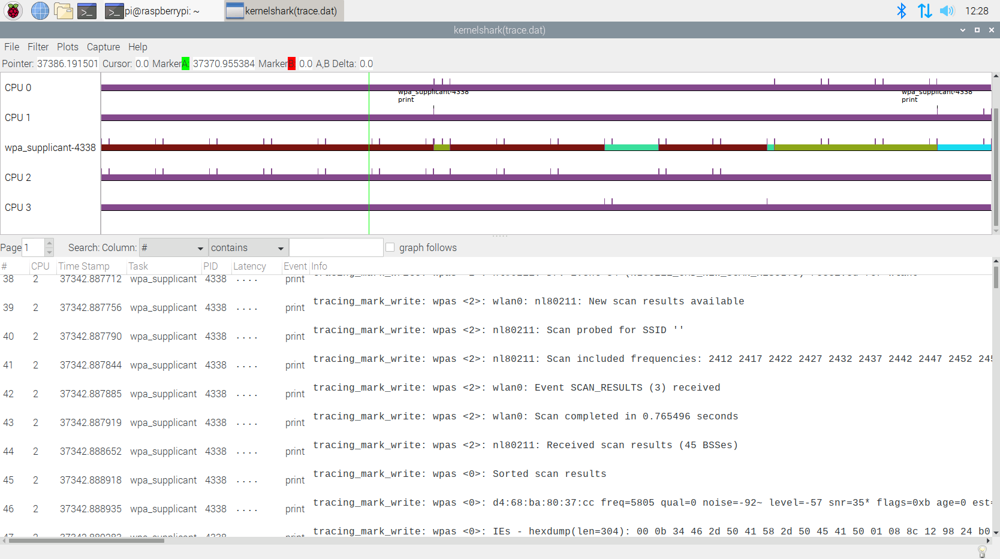

# trace-cmd

理解trace-cmd工作原理

* [一、参考文档](#一参考文档)
* [二、trace_marker](#二trace_marker)
* [三、测试trace_marker](#三测试trace_marker)
* [四、系统支持的监听event](#四系统支持的监听event)

## 一、参考文档

* [Event Tracing](https://www.kernel.org/doc/Documentation/trace/events.rst)
* [Event Tracing](https://www.kernel.org/doc/html/v4.18/trace/events.html)
* [Android 使用 ftrace](https://source.android.com/devices/tech/debug/ftrace)

## 二、trace_marker

This is a very useful file for synchronizing user space with events happening in the kernel. Writing strings into this file will be written into the ftrace buffer.

* 采用wpa_supplicant源代码进行分析，其中trace_marker操作位于: src/utils/wpa_debug.c
  * int wpa_debug_open_linux_tracing(void)
  * void wpa_printf(int level, const char *fmt, ...)
* /sys/kernel/debug/tracing/trace_marker

如下是简单的示例使用代码

```C
int trace_fd = open("trace_marker", WR_ONLY);

void trace_write(const char *fmt, ...)
{
        va_list ap;
        char buf[256];
        int n;

        if (trace_fd < 0)
                return;

        va_start(ap, fmt);
        n = vsnprintf(buf, 256, fmt, ap);
        va_end(ap);

        write(trace_fd, buf, n);
}
```

这里需要需要注意的是上面的王`trace_marker`中些内容，其实是相当于调用`printk`，所以后面使用trace-cmd进行event监听的时候是要监听`printk`的。

## 三、测试trace_marker

* ./wpa_supplicant -c/etc/wpa_supplicant/wpa_supplicant.conf -iwlan0 -Dnl80211,wext -T
* 监听事件：
  * 监听所有event：trace-cmd record -e all -P 4338
  * 只见听一个printk事件：trace-cmd record -e printk -P 4338
  * 只见多个事件：trace-cmd record -e printk -e sys_enter -P 4338
* 上面`trace-cmd record`命令会生成`trace.dat`文件
* 使用`kernelshark`查看`trace.dat`



## 四、系统支持的监听event

`cat /sys/kernel/debug/tracing/available_events`