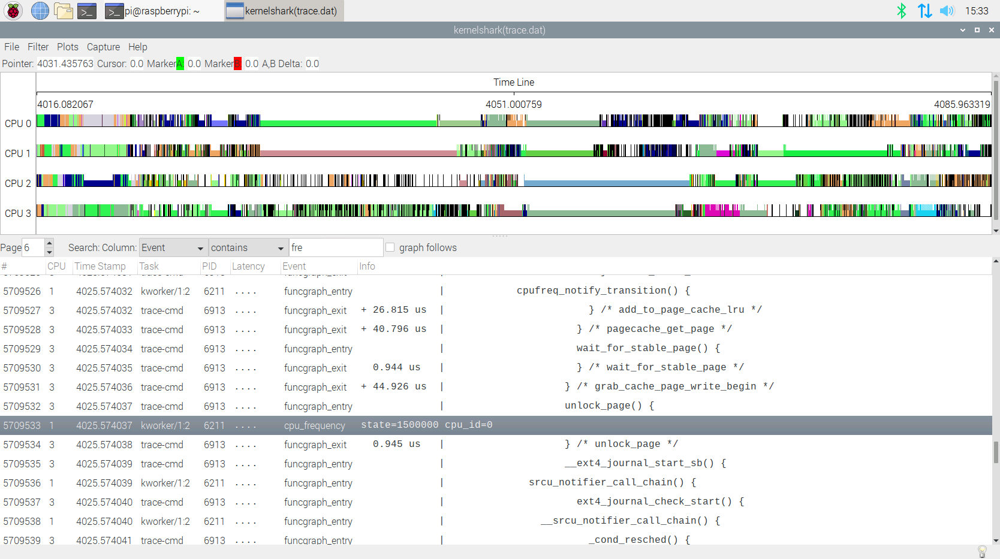
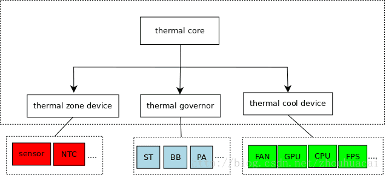

# ftrace CPU Frequency

理解CPU自动调频

* [一、参考文档](#一参考文档)
* [二、获取CPU频率内核调用](#二获取CPU频率内核调用)
* [三、cpufreq](#三cpufreq)
* [四、sys节点文件说明](#四sys节点文件说明)
* [五、设置governor方法](#五设置governor方法)
* [六、温度对频率的影响](#六温度对频率的影响)
  * [6.1 温控参考文档](#61-温控参考文档)
  * [6.2 Thermal原理](#62-Thermal原理)
  * [6.3 DTS Thermal Zone](#63-DTS-Thermal-Zone)
  * [6.4 Thermal Cooling Devices](#64-Thermal-Cooling-Devices)


## 一、参考文档

* [Linux内核的cpufreq(变频)机制](https://www.cnblogs.com/armlinux/archive/2011/04/11/2396824.html)
* [CPUfreq 子系统](https://www.ibm.com/developerworks/cn/linux/l-cpufreq-1/index.html)
* [How to change the default governor?](https://raspberrypi.stackexchange.com/questions/9034/how-to-change-the-default-governor)
* [linux cpufreq framework(1)_概述](http://www.wowotech.net/pm_subsystem/cpufreq_overview.html)


## 二、获取CPU频率内核调用

采用这种方式来反推CPU变频机制是由于目前自己也不知道查什么资料，最后通过`cpufreq_notify_transition()`检索到`cpufreq`子系统，从而完成信息获取

`trace-cmd record -e power -e regulator -p function_graph`

* kernelshark查看：
  
* 文本查看：`trace-cmd report`
  * 检索：cpu_frequency
* 如下是部分调用信息
  ```
       kworker/1:2-6211  [001]  4025.574022: funcgraph_entry:                   |                      kfree() {
         trace-cmd-6913  [003]  4025.574022: funcgraph_exit:         2.166 us   |                            }
       kworker/1:2-6211  [001]  4025.574023: funcgraph_exit:         1.074 us   |                      }
         trace-cmd-6913  [003]  4025.574023: funcgraph_entry:                   |                            mem_cgroup_commit_charge() {
       kworker/1:2-6211  [001]  4025.574024: funcgraph_exit:         9.277 us   |                    }
         trace-cmd-6913  [003]  4025.574024: funcgraph_entry:                   |                              mem_cgroup_charge_statistics() {
       kworker/1:2-6211  [001]  4025.574024: funcgraph_exit:       + 11.092 us  |                  }
         trace-cmd-6913  [003]  4025.574025: funcgraph_exit:         0.778 us   |                              }
       kworker/1:2-6211  [001]  4025.574025: funcgraph_exit:       # 1077.389 us |                }
         trace-cmd-6913  [003]  4025.574025: funcgraph_entry:        0.722 us   |                              memcg_check_events();
       kworker/1:2-6211  [001]  4025.574026: funcgraph_entry:                   |                kfree() {
         trace-cmd-6913  [003]  4025.574027: funcgraph_exit:         4.092 us   |                            }
       kworker/1:2-6211  [001]  4025.574027: funcgraph_exit:         1.074 us   |                }
         trace-cmd-6913  [003]  4025.574028: funcgraph_exit:       + 21.389 us  |                          }
       kworker/1:2-6211  [001]  4025.574028: funcgraph_exit:       # 1111.778 us |              }
         trace-cmd-6913  [003]  4025.574029: funcgraph_entry:                   |                          lru_cache_add() {
       kworker/1:2-6211  [001]  4025.574029: funcgraph_exit:       # 1119.889 us |            }
         trace-cmd-6913  [003]  4025.574030: funcgraph_entry:                   |                            __lru_cache_add() {
       kworker/1:2-6211  [001]  4025.574030: funcgraph_exit:       # 1123.185 us |          }
         trace-cmd-6913  [003]  4025.574031: funcgraph_exit:         0.926 us   |                            }
       kworker/1:2-6211  [001]  4025.574031: funcgraph_entry:                   |          cpufreq_freq_transition_end() {
         trace-cmd-6913  [003]  4025.574031: funcgraph_exit:         2.722 us   |                          }
       kworker/1:2-6211  [001]  4025.574032: funcgraph_entry:                   |            cpufreq_notify_transition() {
         trace-cmd-6913  [003]  4025.574032: funcgraph_exit:       + 26.815 us  |                        }
         trace-cmd-6913  [003]  4025.574034: funcgraph_exit:       + 40.796 us  |                      }
         trace-cmd-6913  [003]  4025.574035: funcgraph_entry:        0.944 us   |                      wait_for_stable_page();
         trace-cmd-6913  [003]  4025.574036: funcgraph_exit:       + 44.926 us  |                    }
         trace-cmd-6913  [003]  4025.574037: funcgraph_entry:                   |                    unlock_page() {
       kworker/1:2-6211  [001]  4025.574038: cpu_frequency:        state=1500000 cpu_id=0
         trace-cmd-6913  [003]  4025.574038: funcgraph_exit:         0.945 us   |                    }
         trace-cmd-6913  [003]  4025.574039: funcgraph_entry:                   |                    __ext4_journal_start_sb() {
       kworker/1:2-6211  [001]  4025.574039: funcgraph_entry:                   |              srcu_notifier_call_chain() {
         trace-cmd-6913  [003]  4025.574040: funcgraph_entry:                   |                      ext4_journal_check_start() {
       kworker/1:2-6211  [001]  4025.574040: funcgraph_entry:                   |                __srcu_notifier_call_chain() {
         trace-cmd-6913  [003]  4025.574041: funcgraph_entry:                   |                        _cond_resched() {
       kworker/1:2-6211  [001]  4025.574041: funcgraph_entry:                   |                  __srcu_read_lock() {
         trace-cmd-6913  [003]  4025.574042: funcgraph_entry:                   |                          rcu_all_qs() {
       kworker/1:2-6211  [001]  4025.574042: funcgraph_exit:         1.037 us   |                  }
         trace-cmd-6913  [003]  4025.574043: funcgraph_exit:         0.945 us   |                          }
       kworker/1:2-6211  [001]  4025.574043: funcgraph_entry:                   |                  notifier_call_chain() {
         trace-cmd-6913  [003]  4025.574044: funcgraph_exit:         2.741 us   |                        }
       kworker/1:2-6211  [001]  4025.574044: funcgraph_entry:                   |                    cpufreq_callback() {
         trace-cmd-6913  [003]  4025.574045: funcgraph_exit:         4.555 us   |                      }
       kworker/1:2-6211  [001]  4025.574045: funcgraph_exit:         0.962 us   |                    }
         trace-cmd-6913  [003]  4025.574046: funcgraph_entry:                   |                      jbd2__journal_start() {
       kworker/1:2-6211  [001]  4025.574046: funcgraph_exit:         2.833 us   |                  }
         trace-cmd-6913  [003]  4025.574047: funcgraph_entry:                   |                        kmem_cache_alloc() {
       kworker/1:2-6211  [001]  4025.574047: funcgraph_entry:                   |                  __srcu_read_unlock() {
         trace-cmd-6913  [003]  4025.574048: funcgraph_entry:                   |                          _cond_resched() {
       kworker/1:2-6211  [001]  4025.574048: funcgraph_exit:         1.019 us   |                  }
         trace-cmd-6913  [003]  4025.574049: funcgraph_entry:                   |                            rcu_all_qs() {
       kworker/1:2-6211  [001]  4025.574049: funcgraph_exit:         8.481 us   |                }
         trace-cmd-6913  [003]  4025.574049: funcgraph_exit:         0.926 us   |                            }
       kworker/1:2-6211  [001]  4025.574050: funcgraph_exit:       + 10.297 us  |              }
         trace-cmd-6913  [003]  4025.574050: funcgraph_exit:         2.741 us   |                          }
       kworker/1:2-6211  [001]  4025.574051: cpu_frequency:        state=1500000 cpu_id=1
         trace-cmd-6913  [003]  4025.574051: funcgraph_entry:                   |                          should_failslab() {
       kworker/1:2-6211  [001]  4025.574051: funcgraph_entry:                   |              srcu_notifier_call_chain() {
         trace-cmd-6913  [003]  4025.574052: funcgraph_exit:         0.926 us   |                          }
       kworker/1:2-6211  [001]  4025.574052: funcgraph_entry:                   |                __srcu_notifier_call_chain() {
         trace-cmd-6913  [003]  4025.574053: funcgraph_entry:                   |                          memcg_kmem_put_cache() {
       kworker/1:2-6211  [001]  4025.574053: funcgraph_entry:                   |                  __srcu_read_lock() {
  ```
* cpufreq_notify_transition()函数很关键的样子
* 检索发现是属于`cpufreq`子系统

## 三、cpufreq

cpufreq framework的功能也被称作动态电压/频率调整（Dynamic Voltage/Frequency Scaling）——DVFS：通过调整CPU core的电压和频率，兼顾系统的性能和功耗，在不需要高性能时，降低电压和频率，以降低功耗；在需要高性能时，提高电压和频率，以提高性能。要达到此目的，有两个关键点：
* 如何控制CPU core的电压和频率。
* 何时改变CPU core的电压和频率。

实现1：CPU core根据自身的负荷，自动调整电压和频率，不需要OS级别的软件参与。
* 由CPU core自行处理；
* OS需要根据大致的应用场景（例如，是高性能场景，还是低性能场景），设定一个频率范围，改变时机，由CPU core自行决定。

实现2：CPU core不参与任何的逻辑动作，由OS软件根据系统运行情况，调整电压和频率。
* 基于clock framework和regulator framework提供的接口，控制CPU core的频率和电压；
* 根据应用场景，手动（用户发起，例如省电模式）或者自动（软件自动调整，例如HMP）的调整。

为了实现上述功能需求，cpufreq framework抽象出cpufreq driver、cpufreq policy（策略）、cpufreq governor等多个软件实体。cpufreq policy负责设定cpu调频的一个大致范围，cpu具体运行频率，需要相应的cpufreq governor决定，最终由cpufreq driver将governor给出的频率设定到硬件上去。

cpufreq的通知系统使用了内核的标准通知接口。它对外提供了两个通知事件：policy通知和transition通知。

policy通知用于通知其它模块cpu的policy需要改变，每次policy改变时，该通知链上的回调将会用不同的事件参数被调用3次，分别是：
* CPUFREQ_ADJUST: 只要有需要，所有的被通知者可以在此时修改policy的限制信息，比如温控系统可能会修改在大允许运行的频率。
* CPUFREQ_INCOMPATIBLE: 只是为了避免硬件错误的情况下，可以在该通知中修改policy的限制信息。
* CPUFREQ_NOTIFY: 真正切换policy前，该通知会发往所有的被通知者

transition通知链用于在驱动实施调整cpu的频率时，用于通知相关的注册者。每次调整频率时，该通知会发出两次通知事件：
* CPUFREQ_PRECHANGE: 调整前的通知。
* CPUFREQ_POSTCHANGE: 完成调整后的通知。

当检测到因系统进入suspend而造成频率被改变时，以下通知消息会被发出：
* CPUFREQ_RESUMECHANGE

cpufreq governor的调频思路：
* 有两种类型的cpu：一种只需要给定频率范围，cpu会在该范围内自行确定运行频率；另一种需要软件指定具体的运行频率。
* 对于第一种cpu，cpufreq policy中会指定频率范围policy->{min,max}，之后通过setpolicy接口，使其生效即可。
* 对于第二种cpu，cpufreq policy在指定频率范围的同时，会指明使用的governor。governor在启动后，会动态的活着静态的，设定cpu运行频率。

Linux内部共有五种对频率的governor管理策略userspace，conservative，ondemand，powersave 和 performance:
* performance ：CPU会固定工作在其支持的最高运行频率上；
* powersave ：CPU会固定工作在其支持的最低运行频率上。因此这两种 governors 都属于静态 governor ，即在使用它们时 CPU 的运行频率不会根据系统运行时负载的变化动态作出调整。这两种 governors 对应的是两种极端的应用场景，使用 performance governor 体现的是对系统高性能的最大追求，而使用 powersave governor 则是对系统低功耗的最大追求。
* Userspace：最早的 cpufreq 子系统通过 userspace governor 为用户提供了这种灵活性。系统将变频策略的决策权交给了用户态应用程序，并提供了相应的接口供用户态应用程序调节 CPU 运行频率使用。 （可以使用Dominik 等人开发了cpufrequtils 工具包 ）
* ondemand ：userspace是内核态的检测，效率低。而ondemand正是人们长期以来希望看到的一个完全在内核态下工作并且能够以更加细粒度的时间间隔对系统负载情况进行采样分析的 governor。
* conservative ： ondemand governor 的最初实现是在可选的频率范围内调低至下一个可用频率。这种降频策略的主导思想是尽量减小对系统性能的负面影响，从而不会使得系统性能在短时间内迅速降低以影响用户体验。但是在 ondemand governor 的这种最初实现版本在社区发布后，大量用户的使用结果表明这种担心实际上是多余的， ondemand governor在降频时对于目标频率的选择完全可以更加激进。因此最新的 ondemand governor 在降频时会在所有可选频率中一次性选择出可以保证 CPU 工作在 80% 以上负荷的频率，当然如果没有任何一个可选频率满足要求的话则会选择 CPU 支持的最低运行频率。大量用户的测试结果表明这种新的算法可以在不影响系统性能的前提下做到更高效的节能。在算法改进后， ondemand governor 的名字并没有改变，而 ondemand governor 最初的实现也保存了下来，并且由于其算法的保守性而得名 conservative 。

Ondemand降频更加激进，conservative降频比较缓慢保守，事实使用ondemand的效果也是比较好的。树莓派默认采用的降频机制：`/sys/devices/system/cpu/cpu0/cpufreq/scaling_governor`是`ondemand`

## 四、sys节点文件说明

* /sys/devices/system/cpu/cpu0/cpufreq
  ```
  affected_cpus     cpuinfo_min_freq            scaling_available_frequencies  scaling_driver    scaling_min_freq
  cpuinfo_cur_freq  cpuinfo_transition_latency  scaling_available_governors    scaling_governor  scaling_setspeed
  cpuinfo_max_freq  related_cpus                scaling_cur_freq               scaling_max_freq  stats
  ```
* 主要内容解释：
  * cpuinfo_max_freq、cpuinfo_min_freq：分别给出了 CPU 硬件所支持的最高运行频率及最低运行频率，
  * cpuinfo_cur_freq：则会从 CPU 硬件寄存器中读取 CPU 当前所处的运行频率。
  * Governor在选择合适的运行频率时只会在 scaling_max_freq 和 scaling_min_freq 所确定的频率范围内进行选择
  * scaling_cur_freq：返回的是 cpufreq 模块缓存的 CPU 当前运行频率，而不会对 CPU 硬件寄存器进行检查。
  * scaling_available_governors：会告诉用户当前有哪些 governors 可供用户使用
  * scaling_driver：则会显示该 CPU 所使用的变频驱动程序
  * Scaling_governor：则会显示当前的管理策略，往这个上echo其他类型会有相应的转变。
  * scaling_setspeed：需将governor类型切换为userspace，才会出现，往这个文件echo数值，会切换主频
  * 以下是将governor切换为ondemand后生成的ondemand文件夹下出现的配置文件。（conservative就不说了，不准备使用）：
    * sampling_rate：当前使用的采样间隔 ，单位：微秒
    * sampling_rate_min：允许使用的最短采样间隔
    * sampling_rate_max：允许使用的最长采样间隔
    * up_threshold ：表明了系统负载超过什么百分比时 ondemand governor 会自动提高 CPU 的运行频率
    * ignore_nice_load：ignore_nice_load 文件可以设置为 0 或 1（0 是默认设置）。当这个参数设置为 1 时，任何具有 “nice”值的处理器不计入总处理器利用率。在设置为 0 时，所有处理器都计入利用率。

## 五、设置governor方法

```plantuml
@startsalt
* /sys/devices/system/cpu
  * cpu0/cpufreq
    * scaling_governor
@endsalt
```

## 六、温度对频率的影响

### 6.1 温控参考文档

* [Linux Thermal Framework分析及实施](https://www.cnblogs.com/arnoldlu/p/11207142.html)
* [thermal的cpu cool device](https://blog.csdn.net/tiantao2012/article/details/78286083?utm_source=blogxgwz4)
* [如何使用CPU cooling API](https://blog.csdn.net/qq_33160790/article/details/84931408)
* [Linux电源管理（五）thermal](https://blog.csdn.net/zhouhuacai/article/details/78172267)


### 6.2 Thermal原理

thermal子系统是内核提供的温控管理框架，一套软件温度解决方案，配合ic内部温度传感器，对ic温度进行管控，保证系统稳定性。thermal系统多用于对ic内部的重点发热模块的功能管控，如cpu、gpu。**thermal sensor驱动负责读取硬件温度sensor的温度，并传给thermal 子系统，thermal子系统将根据调控对象的温度，决定是否触发对应的冷却措施，如限制CPU最大工作频率，以及CPU打开的核数等，从而实现对系统的冷却。**

Thermal zone代表一个温控管理区间，可以将其看做一个虚拟意义上的温度Sensor， 需要有对应的物理Sensor与其关联再能发挥作用。一个Thermal Zone最多可以关联一个Sensor，但该Sensor可以是多个硬件Sensor的混合。

Trip Point即触发点，由Thermal Zone维护。每个thermal zone可以维护多个trip point。Trip Point包含以下信息：
* temp：触发温度，当温度到达触发温度则该trip point被触发。
* type：trip point类型，沿袭PC散热方式，分为四种类型—passive、active、hot、critical。
* cooling device绑定信息：记录在thermal_instance结构体中，描述trip point与cooling device的绑定关系，即当trip point触发后由那个cooling device去实施冷却措施。每个trip point必须与一个cooling device绑定，才有实际意义。

cooling device是实际对系统实施冷却措施的驱动，温控的执行者。cooling device 维护一个cooling等级，即state，一般state越高即系统的冷却需求越高。cooling device根据不同等级的冷却需求进行冷却行为。cooling device只根据state进行冷却操作，是实施者，而state的计算由thermal governor完成。



### 6.3 DTS Thermal Zone

```
thermal-zones {
        cpu_thermal: cpu-thermal {
                polling-delay-passive = <0>;
                polling-delay = <1000>;

                thermal-sensors = <&thermal>;

                trips {
                        cpu-crit {
                                temperature     = <80000>;
                                hysteresis      = <0>;
                                type            = "critical";
                        };
                };

                cooling-maps {
                };
        };
};
```

### 6.4 Thermal Cooling Devices

参考文档：[Linux Thermal 框架解析](http://kernel.meizu.com/linux-thermal-framework-intro.html)

Thermal Cooling Device 是可以降温设备的抽象，能降温的设备比如风扇，这些好理解，但是想 CPU,GPU 这些 Cooling devices 怎么理解呢？

其实降温可以从两方面来理解，一个是加快散热，另外一个就是降低产热量。风扇，散热片这些是用来加快散热，CPU,GPU 这些 Cooling devices 是通过降低产热来降温：
* Thermal Cooling device 抽象的方式是，认为所有的能降温的设备有很多可以单独控制的状态。例如，风扇有不同的风速状态，
* CPU/GPU Cooling device 有不同最大运行频率状态，这样当温度高了之后通过调整这些状态来降低温度；
