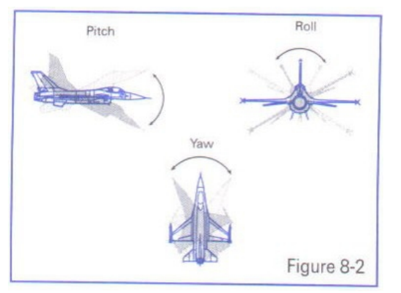
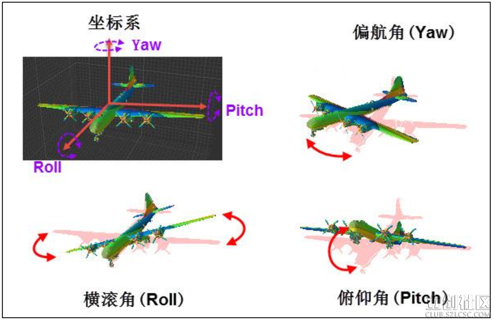
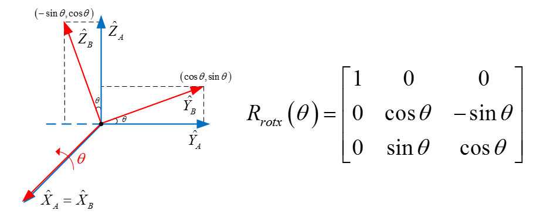
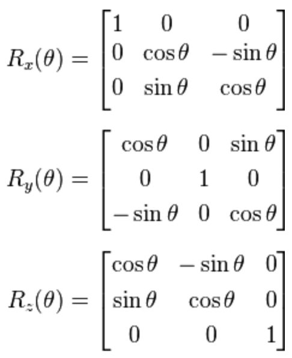
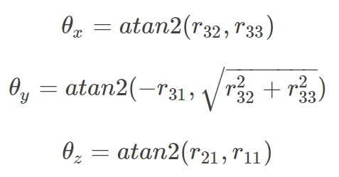

# AHRS

AHRS俗称航姿参考系统，AHRS由加速度计，磁场计，陀螺仪构成，AHRS的真正参考来自于地球的重力场和地球的磁场

* [一、参考文档](#一参考文档)
* [二、基本概念](#二基本概念)
* [三、地理坐标系](#三地理坐标系)
* [三、欧拉角](#三欧拉角)
* [四、欧拉角转成旋转矩阵](#四欧拉角转成旋转矩阵)
* [五、旋转矩阵转欧拉角](#五旋转矩阵转欧拉角)
* [六、四元素](#六四元素)

## 一、参考文档

* [AHRS姿态解算说明(加速度+陀螺仪+磁力计原理及原始数据分析)](http://www.51hei.com/bbs/dpj-92911-1.html)
* [AHRS（航姿参考系统）和IMU（惯性测量单元）的区别](https://blog.csdn.net/qq_39554681/article/details/89712211)
* [四元数与欧拉角（RPY角）的相互转换](https://www.cnblogs.com/21207-iHome/p/6894128.html)
* [飞行姿态解算（一）](https://zhuanlan.zhihu.com/p/20382236)
* [飞行姿态解算（二）](https://zhuanlan.zhihu.com/p/20391408)
* [飞行姿态解算（三）](https://zhuanlan.zhihu.com/p/20406702)

## 二、基本概念

AHRS俗称航姿参考系统，AHRS由加速度计，磁场计，陀螺仪构成，AHRS的真正参考来自于地球的重力场和地球的磁场。

(IMU）Inertial measurement unit：学名惯性测量单元，大学的理论力学告诉我们，所有的运动都可以分解为一个直线运动和一个旋转运动，故这个惯性测量单元就是测量这两种运动，直线运动通过加速度计可以测量，旋转运动则通过陀螺。

6 DOF: Six degrees of freedom

实际上AHRS比IMU还多一个磁场传感器，而为什么AHRS的级别却低于IMU而需要依赖于重力场和磁场呢？这是由传感器器件架构所决定的。AHRS的传感器通常是成本低廉的mems传感器。这种传感器的陀螺仪和加速度计的噪声相对来说很大，以平面陀螺为例用ADI的陀螺仪进行积分一分钟会漂移2度左右，这种前提下如果没有磁场和重力场来修正三轴陀螺的话。那么基本上3分钟以后物体的实际姿态和测量输出姿态就完全变样了，所以在这种低价陀螺仪和加速度计的架构下必须运用场向量来进行修正。

使用IMU来测量姿态也只能相对于飞行器的初始姿态，或理想姿态来测量和描述。

## 三、地理坐标系

在飞机上建立一个坐标系，X轴为机翼的方向，Y轴为机头的方向，Z轴垂直于飞机，这个坐标系是随着飞机姿态改变而变动的，此时就要求飞机的姿态，就等价于求出这个坐标系，那么如何得到这个坐标系？要得到一个新的坐标系，首先要有一个参考坐标系，一般选取Y轴正向为正北，x正向为正东，z轴垂直于地平面了，给他取个名字，就叫地理坐标系吧。

## 三、欧拉角

欧拉角是很直观的，一个物体的旋转，可以分解到三个坐标轴上的旋转。这三个旋转角度就是欧拉角。在惯性系统中一般把这三个角度分别称为俯仰角（Pitch）、横滚角（Roll）和偏航角（Yaw）。上个直观的图，很容易理解。

  


用欧拉角来描述物体的旋转不光需要有角度，还需要有旋转顺序，一般旋转顺序是先yaw后pitch，再roll反应到坐标轴上就是先绕Z轴旋转，再绕X轴旋转，最后绕Y轴旋转。需要注意的是 yaw pitch roll 都是对应的固定的参考系 也就是上面说的地理坐标系而言，每次新的姿态坐标系都是由地理坐标系通过欧拉角旋转得到的。这样我们就用欧拉角表示了物体的姿态。

## 四、欧拉角转成旋转矩阵



```
    | 1 |      |  0   |      |   0   |
x = | 0 |  y = | cos0 |  z = | -sin0 |
    | 0 |      | sin0 |      |  cos0 |

x^2 =                      1;
y^2 = cos0^2 + sin0^2    = 1;
z^2 = (-sin0)^2 + cos0^2 = 1;

如上可知：
  1. 矩阵第一列为X轴信息；
  2. 矩阵第二列为Y轴信息；
  3. 矩阵第三列为Z轴信息；
```

如上可知，三个轴就有三个欧拉矩阵



如果依次绕x轴、y轴、z轴旋转，该变换的旋转矩阵为：

`R=Rz⋅Ry⋅Rx`

记三个轴欧拉角的正弦和余弦函数为sx,cx,sy,cy,sz,cz。使用推导旋转矩阵R：


## 五、旋转矩阵转欧拉角

设旋转矩阵i行j列元素为rij。根据旋转矩阵的表达式，利用三角函数可以推导出欧拉角取值：



## 六、四元素

暂时不花时间去理解，有需要再看

* [如何形象地理解四元数？ - 知乎](https://www.zhihu.com/question/23005815/answer/483589712)
  * https://krasjet.github.io/quaternion/quaternion.pdf
  * https://link.zhihu.com/?target=https%3A//www.bilibili.com/video/av33385105
* [四元数——基本概念](https://zhuanlan.zhihu.com/p/27471300)